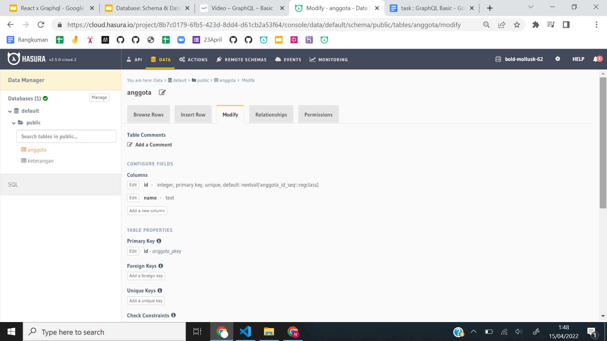
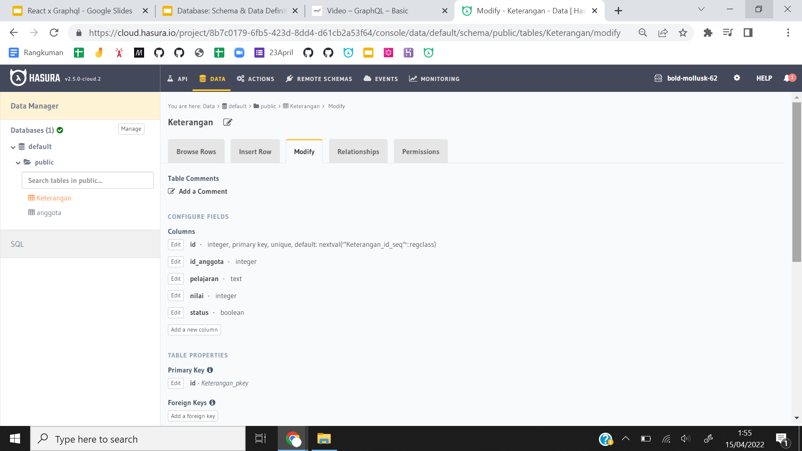
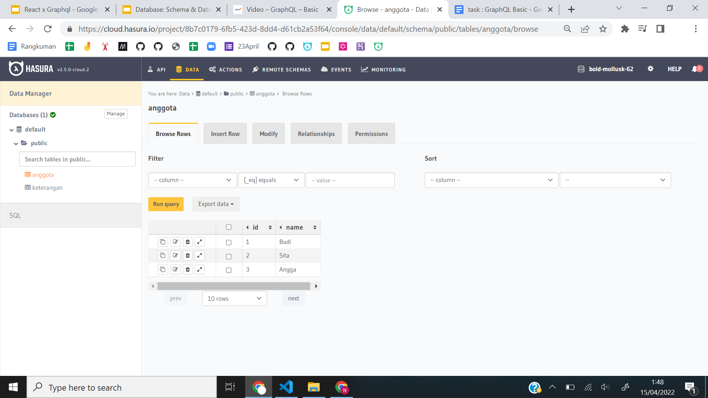
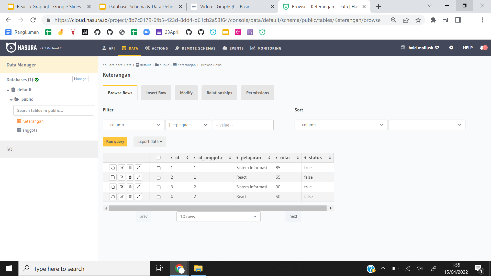
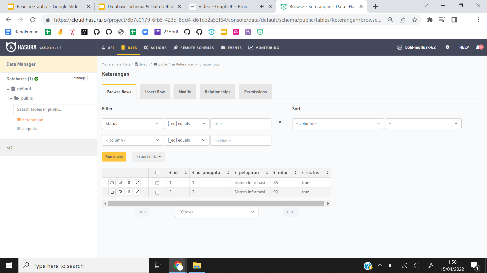
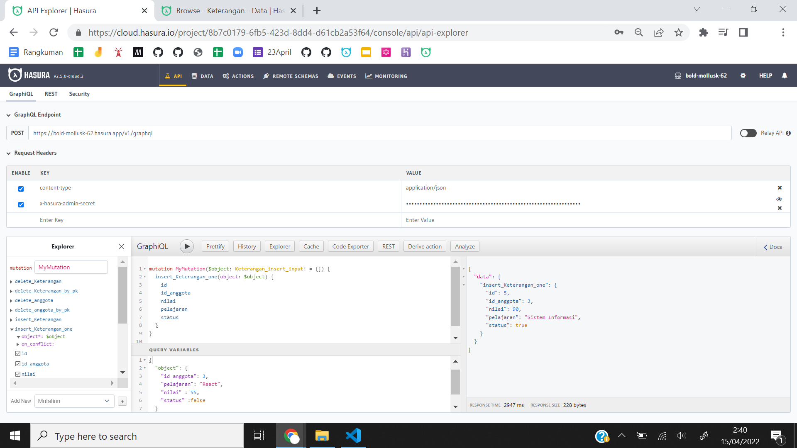
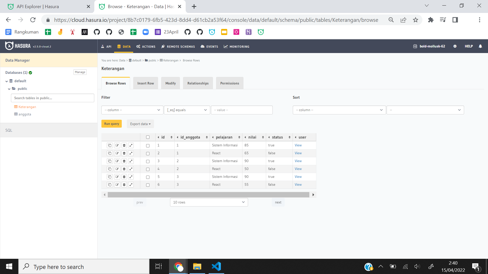
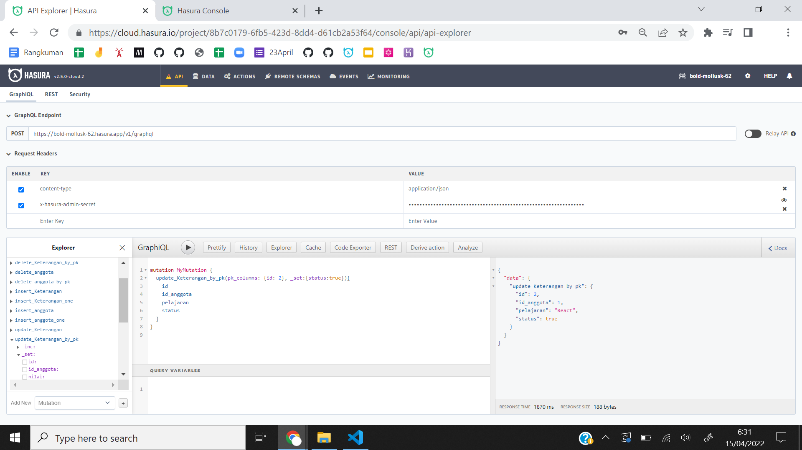

# Praktikum Graph QL

- Membuat tabel anggota

- Membuat tabel keterangan

- Mengisi data pada tabel anggota

- Mengisi data pada tabel keterangan

- Memanggil siswa yang memiliki status true

- Insert kepada angga

- Update data true ke false

